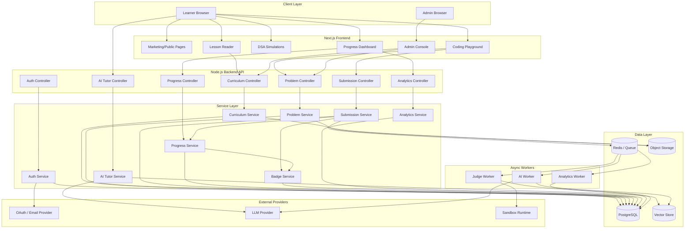
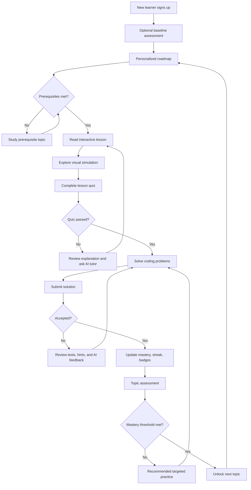
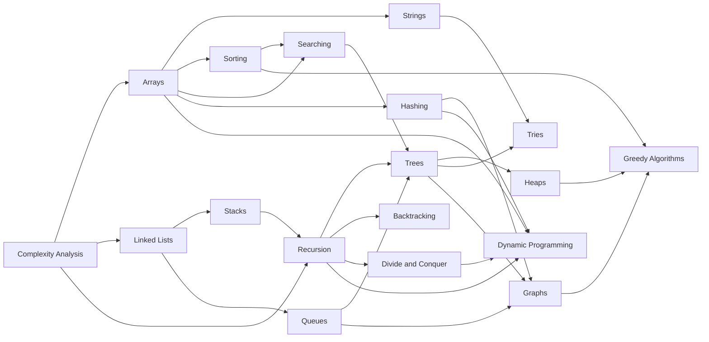

# Diagrams

## 1. Professional architecture diagram

```mermaid
flowchart TB
  subgraph Client["Client Layer"]
    Browser["Learner Browser"]
    AdminBrowser["Admin Browser"]
  end

  subgraph Frontend["Next.js Frontend"]
    Marketing["Marketing/Public Pages"]
    LessonUI["Lesson Reader"]
    SimUI["DSA Simulations"]
    EditorUI["Coding Playground"]
    DashboardUI["Progress Dashboard"]
    AdminUI["Admin Console"]
  end

  subgraph Backend["Node.js Backend API"]
    AuthAPI["Auth Controller"]
    CurriculumAPI["Curriculum Controller"]
    ProblemAPI["Problem Controller"]
    SubmissionAPI["Submission Controller"]
    ProgressAPI["Progress Controller"]
    AnalyticsAPI["Analytics Controller"]
    AITutorAPI["AI Tutor Controller"]
  end

  subgraph Services["Service Layer"]
    AuthService["Auth Service"]
    CurriculumService["Curriculum Service"]
    ProblemService["Problem Service"]
    SubmissionService["Submission Service"]
    ProgressService["Progress Service"]
    BadgeService["Badge Service"]
    AnalyticsService["Analytics Service"]
    AITutorService["AI Tutor Service"]
  end

  subgraph Data["Data Layer"]
    Postgres[("PostgreSQL")]
    Redis[("Redis / Queue")]
    ObjectStorage[("Object Storage")]
    VectorStore[("Vector Store")]
  end

  subgraph Workers["Async Workers"]
    JudgeWorker["Judge Worker"]
    AIWorker["AI Worker"]
    AnalyticsWorker["Analytics Worker"]
  end

  subgraph External["External Providers"]
    AuthProvider["OAuth / Email Provider"]
    LLM["LLM Provider"]
    Sandbox["Sandbox Runtime"]
  end

  Browser --> Marketing
  Browser --> LessonUI
  Browser --> SimUI
  Browser --> EditorUI
  Browser --> DashboardUI
  AdminBrowser --> AdminUI

  LessonUI --> CurriculumAPI
  EditorUI --> ProblemAPI
  EditorUI --> SubmissionAPI
  DashboardUI --> ProgressAPI
  DashboardUI --> AnalyticsAPI
  AdminUI --> CurriculumAPI
  AdminUI --> ProblemAPI
  Browser --> AITutorAPI

  AuthAPI --> AuthService
  CurriculumAPI --> CurriculumService
  ProblemAPI --> ProblemService
  SubmissionAPI --> SubmissionService
  ProgressAPI --> ProgressService
  AnalyticsAPI --> AnalyticsService
  AITutorAPI --> AITutorService

  SubmissionService --> Redis
  SubmissionService --> ProgressService
  SubmissionService --> BadgeService
  ProgressService --> BadgeService

  AuthService --> Postgres
  CurriculumService --> Postgres
  ProblemService --> Postgres
  SubmissionService --> Postgres
  ProgressService --> Postgres
  BadgeService --> Postgres
  AnalyticsService --> Postgres
  AITutorService --> VectorStore
  AITutorService --> LLM

  Redis --> JudgeWorker
  Redis --> AIWorker
  Redis --> AnalyticsWorker
  JudgeWorker --> Sandbox
  JudgeWorker --> Postgres
  AIWorker --> LLM
  AIWorker --> VectorStore
  AnalyticsWorker --> Postgres
  ProblemService --> ObjectStorage
  CurriculumService --> ObjectStorage
  AuthService --> AuthProvider
```

## 2. Learning flow diagram

```mermaid
flowchart TD
  Start["New learner signs up"] --> Baseline["Optional baseline assessment"]
  Baseline --> Roadmap["Personalized roadmap"]
  Roadmap --> TopicCheck{"Prerequisites met?"}
  TopicCheck -- "No" --> Prereq["Study prerequisite topic"]
  Prereq --> TopicCheck
  TopicCheck -- "Yes" --> Lesson["Read interactive lesson"]
  Lesson --> Simulation["Explore visual simulation"]
  Simulation --> Quiz["Complete lesson quiz"]
  Quiz --> QuizScore{"Quiz passed?"}
  QuizScore -- "No" --> Review["Review explanation and ask AI tutor"]
  Review --> Lesson
  QuizScore -- "Yes" --> Practice["Solve coding problems"]
  Practice --> Submit["Submit solution"]
  Submit --> Verdict{"Accepted?"}
  Verdict -- "No" --> Feedback["Review tests, hints, and AI feedback"]
  Feedback --> Practice
  Verdict -- "Yes" --> Progress["Update mastery, streak, badges"]
  Progress --> TopicAssessment["Topic assessment"]
  TopicAssessment --> Mastery{"Mastery threshold met?"}
  Mastery -- "No" --> TargetedPractice["Recommended targeted practice"]
  TargetedPractice --> Practice
  Mastery -- "Yes" --> NextTopic["Unlock next topic"]
  NextTopic --> Roadmap
```

## 3. Topic dependency diagram

```mermaid
flowchart LR
  Complexity["Complexity Analysis"] --> Arrays
  Complexity --> LinkedLists["Linked Lists"]
  Complexity --> Recursion
  Arrays --> Strings
  Arrays --> Sorting
  Arrays --> Searching
  Arrays --> Hashing
  LinkedLists --> Stacks
  LinkedLists --> Queues
  Stacks --> Recursion
  Queues --> Trees
  Recursion --> Trees
  Recursion --> Backtracking
  Recursion --> DivideConquer["Divide and Conquer"]
  Sorting --> Searching
  Sorting --> Greedy["Greedy Algorithms"]
  Searching --> Trees
  Hashing --> Graphs
  Hashing --> DynamicProgramming["Dynamic Programming"]
  Strings --> Tries
  Trees --> Heaps
  Trees --> Tries
  Trees --> Graphs
  Queues --> Graphs
  Heaps --> Greedy
  Graphs --> Greedy
  Recursion --> DynamicProgramming
  Arrays --> DynamicProgramming
  DivideConquer --> DynamicProgramming
```
